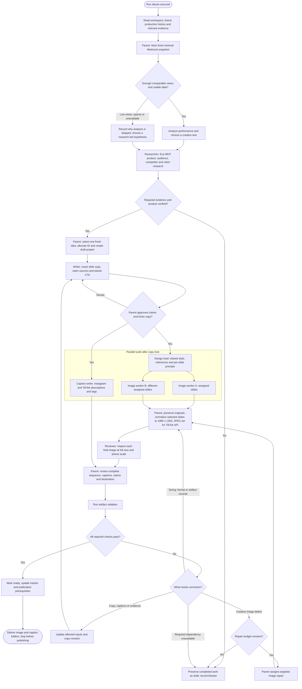

# Carousel workflow flowchart

This diagram summarizes [the skill](../SKILL.md). The stage references remain
authoritative for thresholds, artifact fields and tool instructions.

- **Low views skip detailed analytics only.** Every final image still receives
  visual review. See [performance triage](performance.md).
- **Parallel work has dependencies.** Image workers use the same locked copy and
  design plan, own different slides, and return results to the parent. Review can
  begin on finished exports while other slides generate; final acceptance waits
  for the complete set and captions. With fewer slots, queue roles; with no
  subagents, run the same roles sequentially. See [handoffs](orchestration.md).
- **Repair scope stays small.** Regenerate only affected slides; update affected
  captions and re-review changed outputs. Two creative repair calls are shared
  across the whole run. Export normalization does not consume that budget.
- **Ready means prepared files.** The handoff includes any bio-link and disclosure
  prerequisites. It does not publish, schedule posts or change profiles.
